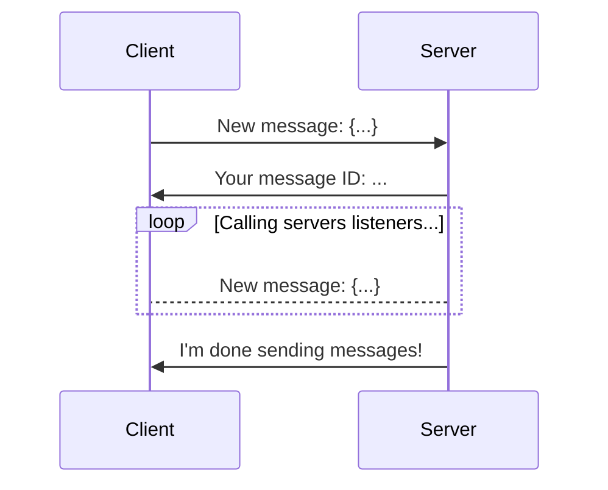

# Messages

## What are messages?

Next to operations, messages are the other core feature of Hoist.

The biggest difference between operations and messages are that messages **do not** return a response. We can listen for new messages and replies, but whether any messages are actually sent is up to the server.

Unlike other messaging solutions, message receiving in Hoist is handled synchronously, meaning we have a time frame when the server may send messages to the client.

This allows Hoist to send and receive without using a message listener or a `while True` loop.

Messages could look like this:



## Listening

!!! note

    The listener API is **exactly the same** for both the client and server. However, in these examples we will do it from the servers perspective.

You can listen for messages via the `receive` decorator:

```py
import hoist

server = hoist.start(...)

@server.receive("test")
async def test():  # this gets called when somebody sends "test"
    print('somebody sent me "test"!')
```

## Getting Parameters

In the example above, we just received no arguments, but that isn't all that useful.

Parameters are done similiarly to operations. Once again, it's recommended to use [type hints](https://peps.python.org/pep-0484/), but we don't have to.

### Message and Payload

=== "Type Hints"

    ```py
    import hoist

    server = hoist.start(...)

    @server.receive("...")
    async def msg(message: hoist.Message, payload: dict):
        ...
    ```

=== "Without Type Hints"

    ```py
    import hoist

    server = hoist.start(...)

    @server.receive("...")
    async def msg(message, payload):
        ...
    ```

### Message Only

=== "Type Hints"

    ```py
    import hoist

    server = hoist.start(...)

    @server.receive("...")
    async def msg(message: hoist.Message):
        ...
    ```

=== "Without Type Hints"

    ```py
    import hoist

    server = hoist.start(...)

    @server.receive("...")
    async def msg(message):
        ...
    ```

## Payload Validation

You can similarly verify payloads as you do with operations.

Pass a schema or a dataclass (once again, liked `NamedTuple`) to the `parameter` keyword argument:

```py
import hoist
from typing import NamedTuple

server = hoist.start(...)

class MyPayload(NamedTuple):
    a: str
    b: str

@server.receive("...", parameter=MyPayload)
async def msg(message: hoist.Message, payload: MyPayload):
    ...
```

## Catch-all Listeners

If you would like a callback to run _everytime_ a message is received, you can just pass nothing to `receive`:

```py
import hoist
server = hoist.start(...)

@server.receive()
async def msg():  # this is called whenever the server receives any message!
    ...
```

## Accepting Multiple Messages

You can pass a tuple of messages to accept multiple messages to one listener:

```py
import hoist
server = hoist.start(...)

@server.receive(("a", "b"))
async def msg(): # called whenever the server receives a or b
    ...
```
