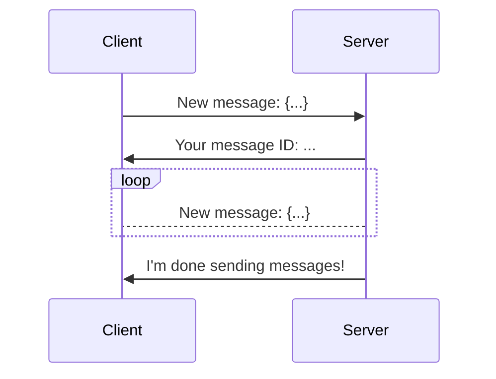

# Messages

## What are messages?

Next to operations, messages are the other core feature of Hoist.

The biggest difference between operations and messages are that messages **do not** return a response. We can listen for new messages and replies, but whether any messages are actually sent is up to the server.

Unlike other libraries, message receiving is handled synchronously, meaning we have a time frame when the server may send messages to the client.

This allows Hoist to send and receive without using a message listener or a `while True` loop.

Messages could look like this:

