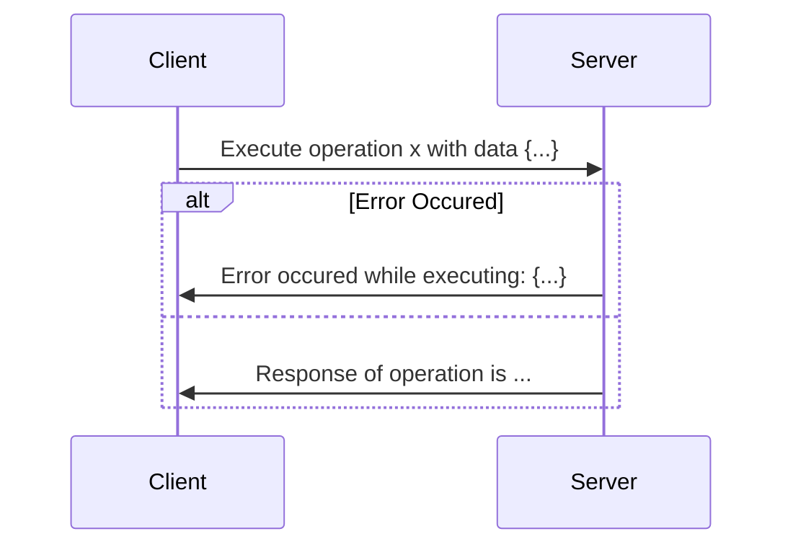

# Operations

## What are operations?

With client-server communication, Hoist has two fundamental items, the first being operations, and the second one being messages, which we will talk about more later.

Think of an operation like a function call. We send a name and some data to the server, and then it sends back the response.

An operation could look like this:



## Whitelisting and Blacklisting

Hoist comes with some operations out of the box. By default, all of these are enabled.

To blacklist one, pass its name to the `unsupported_operations` keyword argument:

```py
import hoist

server = hoist.start(unsupported_operations=("print",))
# all operations work except print
```

If you would like a whilelist instead, pass the whitelisted names to the `supported_operations` argument:

```py
import hoist

server = hoist.start(supported_operations=("print",))
# no operations work except print
```

You may also disable all operations by passing a sequence (such as `tuple`) containing `"*"`:

```py
import hoist

server = hoist.start(unsupported_operations=("*",))
```

## Custom Operations

We can define operations ourself by using the `operation` decorator.

Here's a quick example:

```py
import hoist

server = hoist.start(...)

@server.operation("my custom operation")
async def operation():
    return "hello world"
```

This isn't very useful though, since we aren't getting any arguments from the user.

## Getting Parameters

Hoist will try to figure out what parameters you want based off the signature of the function.

The recommended way to is to use [type hints](https://peps.python.org/pep-0484/), but you can do it without them.

### Server and Payload

=== "Type Hints"

    ```py
    import hoist

    server = hoist.start(...)

    @server.operation("...")
    async def operation(server: hoist.Server, payload: dict):
        ...
    ```

=== "Without Type Hints"

    ```py
    import hoist

    server = hoist.start(...)

    @server.operation("...")
    async def operation(server, payload):
        ...
    ```

### Server Only

```py
import hoist

server = hoist.start(...)

@server.operation("...")
async def operation(server: hoist.Server):
    ...
```

### Payload Only

=== "Type Hints"

    ```py
    import hoist

    server = hoist.start(...)

    @server.operation("...")
    async def operation(payload: dict):
        ...
    ```

=== "Without Type Hints"

    ```py
    import hoist

    server = hoist.start(...)

    @server.operation("...")
    async def operation(payload):
        ...
    ```

### Dynamic Parameters

=== "Type Hints"

    ```py
    import hoist

    server = hoist.start(...)

    @server.operation("...")
    async def operation(a: str):
        ...
    ```

=== "Without Type Hints"

    ```py
    import hoist

    server = hoist.start(...)

    @server.operation("...")
    async def operation(a, b, c):
        ...
    ```
    !!! warning
        You must have 3 or more parameters when you aren't using type hints, otherwise Hoist will interpret as one of the above.

## Payload Validation

You can hint a dataclass (such as `NamedTuple`) as your payload to get Hoist to validate the sent payload.
!!! note

    Hoist uses the `__annotations__` attribute to create schemas for validation. Any custom payload object should contain that with corresponding attributes.

Here's an example:

```py
import hoist
from typing import NamedTuple

server = hoist.start(...)

class MyPayload(NamedTuple):
    a: str
    b: int

@server.operation("...")
async def operation(payload: MyPayload):
    ...
```

The above would make Hoist ensure that the payload sent by the client looks like this:

```json
{
    "a": "...", // any string
    "b": 0 // any number
}
```
